# Arquitectura del Sistema - Cow Detection

Este documento describe la arquitectura de alto nivel del sistema de detección de ganado.

## Diagrama de Arquitectura

```mermaid
graph TB
    %% Usuarios y Frontend
    USER[👤 Usuario]

    %% Aplicación Web
    subgraph "Frontend"
        UPLOAD[📤 Cargar Imágenes]
        VIEW[🖼️ Ver Detecciones]
        DASHBOARD[📱 Dashboard Streamlit<br/>Puerto 8501]
    end

    %% Backend
    subgraph "Backend"
        API[🔌 API FastAPI<br/>Puerto 8000]
        MODEL[🧠 Modelo Faster-RCNN<br/>Detección de Ganado]
    end

    %% Almacenamiento
    subgraph "Almacenamiento"
        S3[☁️ AWS S3<br/>cow-detect-maia]
        DATA[💾 Datos Locales<br/>Modelos entrenados]
    end

    %% Pipeline ML (simplificado)
    subgraph "ML Pipeline"
        DATASETS[📁 Datasets<br/>Sky + ICAERUS]
        TRAINING[🎯 Entrenamiento<br/>DVC Pipeline]
    end

    %% Flujos principales
    USER --> UPLOAD
    USER --> VIEW
    UPLOAD --> DASHBOARD
    VIEW --> DASHBOARD

    DASHBOARD -->|Subir imágenes| API
    DASHBOARD -->|Obtener detecciones| API

    API -->|Procesar imágenes| MODEL
    API -->|Guardar/leer imágenes| S3

    MODEL -->|Cargar pesos| DATA
    DATASETS -->|Entrenar| TRAINING
    TRAINING -->|Generar modelos| DATA

    %% Estilos
    classDef frontend fill:#e1f5fe
    classDef backend fill:#f3e5f5
    classDef storage fill:#e8f5e8
    classDef ml fill:#fff3e0

    class USER,UPLOAD,VIEW,DASHBOARD frontend
    class API,MODEL backend
    class S3,DATA storage
    class DATASETS,TRAINING ml
```

## Componentes Principales

### Frontend
- **Dashboard Streamlit** (Puerto 8501): Interface web con dos funcionalidades principales:
  - **Cargar Imágenes**: Permite subir imágenes al sistema para su procesamiento
  - **Ver Detecciones**: Visualiza los resultados de detección con bounding boxes

### Backend
- **API FastAPI** (Puerto 8000): Servicio REST que expone endpoints para:
  - Procesamiento de imágenes
  - Gestión de archivos en S3
  - Comunicación con el modelo de ML
- **Modelo Faster-RCNN**: Modelo de detección de objetos entrenado para identificar ganado

### Almacenamiento
- **AWS S3**: Bucket `cow-detect-maia` para almacenamiento de imágenes
- **Datos Locales**: Almacenamiento de modelos entrenados y datos de entrenamiento

### ML Pipeline
- **Datasets**: Conjuntos de datos Sky y ICAERUS para entrenamiento
- **DVC Pipeline**: Sistema de versionado y orquestación del entrenamiento de modelos

## Tecnologías Utilizadas

- **Frontend**: Streamlit, Python
- **Backend**: FastAPI, PyTorch, Python
- **ML**: Faster-RCNN, torchvision, DVC
- **Storage**: AWS S3, boto3
- **Containerization**: Docker, docker-compose
- **Task Management**: Poethepoet

## Flujo de Trabajo

1. El usuario accede al dashboard Streamlit
2. Puede cargar imágenes que se almacenan en S3 y se procesan a través de la API
3. La API utiliza el modelo Faster-RCNN para detectar ganado en las imágenes
4. Los resultados se muestran en la interfaz con bounding boxes
5. El pipeline de ML permite entrenar nuevas versiones del modelo con datasets actualizados